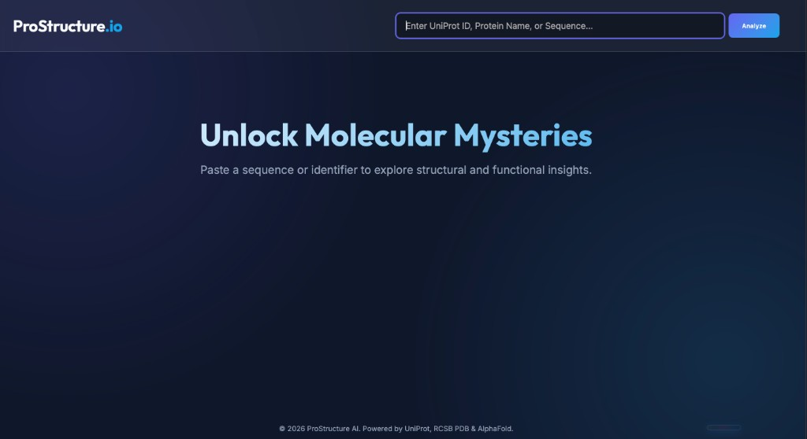
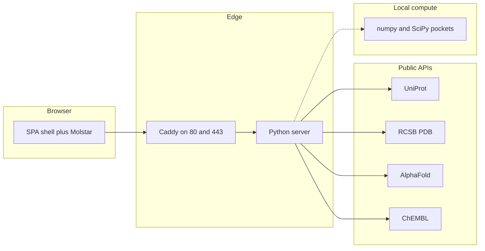

<p align="center">
  
</p>

<h1 align="center">Unlock molecular mysteries</h1>

<p align="center">
  <strong>ProStructure.io</strong> — a minimalist protein intelligence dashboard.<br/>
  Paste a <em>UniProt ID</em>, protein name, or raw sequence → explore structures, cavities, ligands, and confidence maps in one calm, glass-morphism canvas.
</p>

<p align="center">
  
  
  
  
</p>

<p align="center">
  
</p>

<p align="center"><sub>Landing hero — deep navy gradients, icy accent blues, Outfit + Inter typography.</sub></p>

---

### Why it exists

ProStructure gathers **UniProt**, **RCSB PDB**, **AlphaFold**, and related chemistry endpoints behind a thin Python edge so the browser avoids CORS friction while **[PDBe Mol★](https://github.com/molstar/pdbe-molstar)** renders the molecule. Pocket geometry can be interrogated locally with a **SciPy-assisted cavity search** baked into [`server.py`](server.py).

---

### Feature snapshot

| | |
| :--- | :--- |
| **Identify anything** | Accessions, descriptive names, or FASTA-ish sequence paste |
| **3D storytelling** | Solved PDB and AlphaFold models with color themes (chains, elements, secondary structure, sequence, **pLDDT**) |
| **Live metadata** | Gene, organism, features, and cross-links pulled through the API façade |
| **Drug context** | ChEMBL-backed mechanism and activity integrations where available |
| **Pockets and voids** | Server-side cavity clustering from atom coordinates |

---

### Architecture



- **Frontend:** `index.html`, `style.css`, `app.js` — Molstar plugin, transitions, tabbed chemistry panels.
- **Backend:** one `socketserver` handler in [`server.py`](server.py); static files from the repo root plus JSON proxies such as `/api/uniprot/…`, `/api/pdb/…`, `/api/alphafold/…`, `/api/chembl/…`, `/api/cavity_search/…`, and more.
- **Production:** Docker image for Python plus **Caddy** as an extensible reverse proxy. Add Node, Go, or another static site by declaring Compose services and `handle_path` routes in [`deploy/Caddyfile`](deploy/Caddyfile).

---

### Design language

Inspired by observatory dashboards — restrained, luminous, scientifically serious. Tokens mirror [`style.css`](style.css):

| Token | Hex | Role |
| ------ | ----- | ----- |
| `bg-dark` | `#0f172a` | Infinite-sky backdrop |
| `primary` | `#6366f1` | Indigo focus rings and pills |
| `secondary` | `#0ea5e9` | CTA allies and brand span |
| `accent` | `#22d3ee` | Highlights and hero emphasis |
| `text` / `text-muted` | `#f8fafc` / `#94a3b8` | Body copy tiers |
| `card-bg` | `rgba(30,41,59,0.7)` | Frosted panels |

Typography pairs **Outfit** (wordmark) with **Inter** (data density). Glass layers use `backdrop-filter: blur(10px)` and dual radial washes (`.glass-background`) for depth without clutter.

---

### Run locally with uv

```bash
git clone https://github.com/MariosGiatro/prostructure.git
cd prostructure
uv sync
uv run python server.py
```

Defaults to port **8000**; override with `PORT=8010 uv run python server.py`.

---

### Docker (matches production)

```bash
cd deploy
docker compose up --build -d
```

Visit `http://localhost`. See [`deploy/docker-compose.yml`](deploy/docker-compose.yml) for the optional `nodeapp` template and Caddy wiring.

---

### Google Cloud VM

Step-by-step (firewall tags, preemptible savings, HTTPS) is in **[`deploy/gcp/README.md`](deploy/gcp/README.md)**.

```bash
./deploy/gcp/provision-vm.sh
./deploy/gcp/deploy-to-vm.sh
```

---

### Repository map

| Path | Role |
| ---- | ---- |
| [`index.html`](index.html) | Shell, hero, Molstar mount |
| [`app.js`](app.js) | Search flow, Molstar loaders, tabs |
| [`style.css`](style.css) | Design tokens and layout |
| [`server.py`](server.py) | Static hosting, proxies, cavity engine |
| [`pyproject.toml`](pyproject.toml) / [`uv.lock`](uv.lock) | Locked dependencies |
| [`deploy/`](deploy/) | Caddy stack and GCP scripts |

---

### Data stewardship

Knowledge is assembled from **[UniProt](https://www.uniprot.org/)**, **[RCSB PDB](https://www.rcsb.org/)**, **[AlphaFold DB](https://alphafold.ebi.ac.uk/)**, **[PDBe](https://www.ebi.ac.uk/pdbe/)**, **[ChEMBL](https://www.ebi.ac.uk/chembl/)**, and related public resources. Cite those databases in any publication that builds on this tool.

---

### License

Add your chosen **software license** here when you publish the repository. Downstream use must still respect each data provider’s terms and citation requests.

<p align="center">
  © 2026 ProStructure AI · Powered by UniProt · RCSB PDB · AlphaFold · PDBe Mol★ · ChEMBL
</p>
